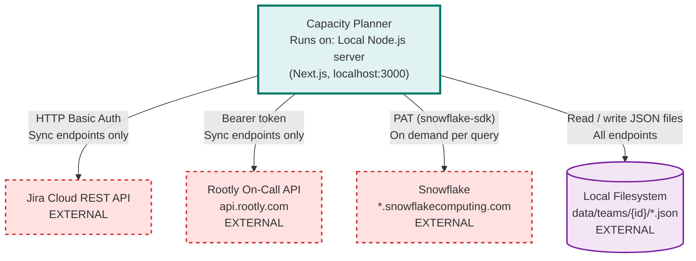

# Capacity Planner Architecture

> **Repository:** manager-notebook
> **Last Updated:** 2026-05-07

## Overview

A locally-hosted Next.js app that pulls sprint data from Jira and on-call shifts from Rootly, then computes team capacity and story-point allocations. Also connects to Snowflake for live feature analytics queries. All Jira/Rootly data is cached to local JSON files; Snowflake is queried on demand.

> **Runtime Environment:** Next.js server running on the developer's local machine (`localhost:3000`)

---

## Architecture Diagram



---

## External Integrations

| External Service | Auth | Purpose |
|-----------------|------|---------|
| Jira Cloud REST API | Basic Auth (email + API token) | Sprint velocity, story points, roadmap, sprint goals |
| Rootly On-Call API (`api.rootly.com`) | Bearer token | On-call shifts and schedules |
| Snowflake (`*.snowflakecomputing.com`) | Programmatic Access Token via `snowflake-sdk` | Live feature analytics queries |
| Local filesystem (`data/`) | — | Persist and read cached data between syncs |

---

## Sync Sequence

Syncs are triggered manually from the UI (Sync button on the dashboard or velocity page, Settings page for roadmap/on-call). There is no background or startup sync.

1. `POST /api/jira/sync` — queries Jira, writes `jira-cache.json`
2. `POST /api/roadmap/sync` — queries Jira for value milestones, writes roadmap cache
3. `GET /api/oncall` — fetches Rootly shifts, writes on-call cache

After each sync, all UI reads are served from the local JSON cache with no further external calls.

---

## Architectural Tenets

### T1. External syncs write to disk; all reads serve from cache (except Snowflake)

The app never calls Jira or Rootly from GET endpoints or from the browser. Snowflake is the exception to this tenet — it is queried live on demand because it serves as an analytics engine where caching results would make the data stale. Snowflake queries are always initiated by explicit user action (running a query or loading a feature page). External HTTP calls happen exclusively in dedicated sync endpoints (`POST /api/jira/sync`, `POST /api/roadmap/sync`), and results are serialised to JSON files under `data/teams/{id}/`. Every other API route reads only from those files.

**Evidence:**
- [`app/api/jira/sync/route.ts`](app/api/jira/sync/route.ts) — calls `jiraFetch`, then `saveJiraCache`; no external calls in any GET route
- [`app/api/capacity/route.ts`](app/api/capacity/route.ts) — reads from `getJiraCache`, `getAbsences`, `getConfig`; zero external HTTP calls

### T2. Capacity computation is pure and I/O-free

All capacity and allocation arithmetic lives in [`lib/capacity/calculations.ts`](lib/capacity/calculations.ts). It accepts plain objects and returns results synchronously — no filesystem reads, no HTTP calls, no side effects. This makes it independently testable and ensures the UI can call it freely.

**Evidence:**
- [`lib/capacity/calculations.ts`](lib/capacity/calculations.ts) (`buildCapacityMatrix`, `getTeamMetrics`) — no `fs`, no `fetch`, no `async`; all inputs passed as arguments
- [`app/api/capacity/route.ts`](app/api/capacity/route.ts) — assembles inputs from data modules, then calls `buildCapacityMatrix` as a pure function

### T3. Each external service has a dedicated client module

Direct HTTP calls to external APIs must not appear in API route handlers or business logic. Every integration has a single client module in `lib/` that owns authentication, base URLs, and error handling.

**Evidence:**
- [`lib/jira/client.ts`](lib/jira/client.ts) — owns `JIRA_BASE_URL`, Basic Auth header, `jiraFetch` / `jiraPost` / `jiraPut`
- [`lib/oncall/rootly.ts`](lib/oncall/rootly.ts) — owns Rootly API calls for schedules and shifts
- [`lib/snowflake/client.ts`](lib/snowflake/client.ts) — owns Snowflake connection setup and `runQuery`; route handlers never call `snowflake-sdk` directly

### T4. The filesystem is the only persistence layer

No database, cache server, or remote store. All mutable state — team config, cached Jira data, absences, on-call cache, sprint comments — is stored as JSON files under `data/teams/{id}/`. Data access is mediated through thin read/write helpers in `lib/data/`.

**Evidence:**
- [`lib/data/config.ts`](lib/data/config.ts) (`getConfig`, `saveConfig`) — reads and writes `data/teams/{id}/config.json` via `fs`
- [`lib/data/teams.ts`](lib/data/teams.ts) — defines `teamDataDir`; all other data modules resolve paths through it

### T5. API route handlers must not contain business logic

Route handlers are responsible for input validation, orchestrating calls to `lib/` modules, and serialising responses. Domain logic (capacity math, holiday computation, JQL generation) lives exclusively in `lib/`.

**Evidence:**
- [`app/api/jira/sync/route.ts`](app/api/jira/sync/route.ts) — delegates sprint fetching and velocity to `lib/jira/sprints.ts` and `lib/jira/velocity.ts`
- [`app/api/oncall/route.ts`](app/api/oncall/route.ts) — delegates shift fetching to `lib/oncall/rootly.ts`
- [`lib/capacity/calculations.ts`](lib/capacity/calculations.ts), [`lib/holidays.ts`](lib/holidays.ts) — all business logic resides here, independent of the HTTP layer

---

## Directory Structure

```
app/                  Pages and API routes (Next.js App Router)
  api/                Server-side API handlers
    jira/             Jira sync endpoints
    capacity/         Capacity calculation endpoints
    roadmap/          Roadmap sync and priority endpoints
    oncall/           On-call data endpoints
    ...
  dashboard/          Sprint overview
  capacity/           Team capacity by quarter
  absences/           Days-off management
  velocity/           Velocity chart and metrics
  team/               Team member configuration
  allocation/         Allocation percentage settings
  sprint-goals/       Sprint goals from Jira
  roadmap/            Value milestone roadmap
  vm-timeline/        Timeline view of value milestones
  gantt/              Gantt chart view
  oncall/             On-call schedule
  snowflake/
    features/         Feature analytics (saved feature configs + charts)
    query/            Ad-hoc Snowflake query runner
  settings/           App settings
  setup/              First-time setup flow

components/
  nav/                Sidebar and team switcher
  ui/                 Generic UI primitives (Button, Card, Input)
  velocity/           Velocity chart component

lib/
  capacity/
    calculations.ts   Core capacity math (buildCapacityMatrix, getTeamMetrics)
  data/               File-based data layer — all reads/writes go through here
    config.ts         Team config (members, SP/day, allocations)
    absences.ts       Absences per member per sprint
    jira-cache.ts     Cached sprint data from Jira
    roadmap-cache.ts  Cached roadmap/VM data
    roadmap-priority.ts  Manual sort order for roadmap items
    teams.ts          Multi-team management
    value-streams.ts  Value stream filter state
    oncall-cache.ts   Cached on-call rotation data
  jira/
    client.ts         Jira HTTP client (jiraFetch, jiraPost, jiraPut)
    sprints.ts        Board discovery and sprint listing
    velocity.ts       Sprint velocity data from Jira's velocity chart endpoint
    roadmap.ts        Value Milestone queries
  oncall/
    rootly.ts         Rootly API client for on-call schedules
  snowflake/
    client.ts         Snowflake connection + runQuery (snowflake-sdk wrapper)
  holidays.ts         Portuguese and US public holiday computation

data/                 Runtime data (gitignored except config.example.json)
  teams.json          List of teams
  active-team.json    Currently active team ID
  snowflake-features.json   Saved feature configs (name, description, SQL charts)
  snowflake-connections.json  Named connection profiles (database, warehouse, schema)
  teams/{id}/         Per-team data directory
    config.json       Team config
    absences.json     Absences
    jira-cache.json   Jira sprint cache
    sprint-comments.json  Manager sprint notes
```

---

## Jira API Usage

| Endpoint | Purpose |
|----------|---------|
| `GET /rest/agile/1.0/board` | Find the scrum board for the configured project key |
| `GET /rest/agile/1.0/board/{id}/sprint` | List all sprints (active, closed, future) |
| `GET /rest/greenhopper/1.0/rapid/charts/velocity` | Initial committed SP per sprint |
| `GET /rest/api/3/search/jql` | Delivered SP (issues in Done / Waiting for Release) |
| `PUT /rest/agile/1.0/sprint/{id}` | Update sprint goal |
| `GET /rest/api/3/search/jql` | Value Milestones for roadmap |

All requests use Basic Auth (email + API token). Responses are never cached by Next.js (`cache: 'no-store'`) — caching is handled manually via `jira-cache.json`.

> **Note on Initial Committed SP:** Source is `/rest/greenhopper/1.0/rapid/charts/velocity` (`velocityStatEntries[sprintId].estimated.value`), not the sprint report. The sprint report inflates this number by including mid-sprint scope additions.

---

## Capacity Model

```
availableDays = workingDays - daysOff - publicHolidays
capacitySP    = availableDays × spPerDay
totalSP       = Σ capacitySP across all members

suggestedSP   = totalSP × (features% + discovery% + debts%)
```

**Working days** are Mon–Fri within the sprint's date range (UTC).

**Public holidays** are computed algorithmically per member's country:
- Portugal: 13 mandatory national holidays including moveable Easter-relative dates (Meeus/Jones/Butcher algorithm)
- US: federal holidays including observed dates for weekends
- Local/company holidays configurable per team in `config.json`

---

## Data Flow: Sprint Sync

```
POST /api/jira/sync
  │
  ├─ getRARBoardId()        → find scrum board for jira_project_key
  ├─ getBoardSprints()      → list all sprints
  ├─ getVelocityData()      → initialCommittedSP per sprint
  ├─ fetchDeliveredSP()     → JQL: status in (Done, "Waiting for Release")
  └─ saveJiraCache()        → write to data/teams/{id}/jira-cache.json
```

## Data Flow: Capacity Page

```
GET /api/capacity
  │
  ├─ getConfig()            → team members, SP/day, allocations
  ├─ getAbsences()          → days off per member per sprint
  ├─ getJiraCache()         → cached sprint data
  ├─ computeWorkingDays()   → Mon–Fri count per sprint
  └─ buildCapacityMatrix()  → SprintCapacity[] with per-member breakdown
```

## Data Flow: Snowflake Query

```
POST /api/snowflake/query  { sql, connectionId? }
  │
  ├─ loadConnection()       → read database/warehouse/schema from snowflake-connections.json
  └─ runQuery(sql, overrides)
       │
       ├─ getConnection()   → createConnection() via snowflake-sdk
       │                       credentials: SNOWFLAKE_ACCOUNT, SNOWFLAKE_USER, SNOWFLAKE_TOKEN
       │                       auth: PROGRAMMATIC_ACCESS_TOKEN
       ├─ conn.connect()    → establish session
       └─ conn.execute()    → return rows as Record<string, unknown>[]
```

Unlike Jira/Rootly, results are never written to disk — each query runs live and returns directly to the browser.
