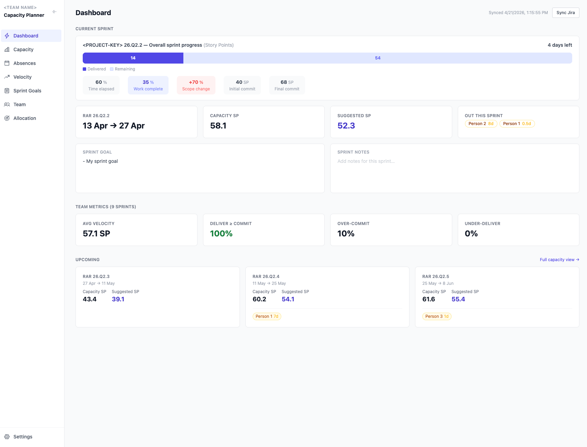

# Manager Notebook

A personal productivity system for engineering managers. Built to support day-to-day leadership — drafting messages, tracking initiatives, prepping for meetings, performance cycles — with Claude as a thinking partner.

---

## How This Works

This is a Markdown-based notebook used with Claude. Before doing anything, Claude reads `AGENTS.md` for instructions on how to work with the system, then loads the key context files.

**First-time setup:** run `"Follow the instructions in BOOTSTRAP.md"` to generate the local config files the system needs.

---

## Vault Structure

```
manager-notebook/
├── AGENTS.md                         # How Agents works with this system — read first
├── BOOTSTRAP.md                      # First-time setup guide
├── memory/
│   ├── jira_context.md               # Jira field IDs, JQL templates, query behaviour
│   └── workspace.local.md            # ⚠ NOT committed — identity, project keys, VM snapshot
├── me/
│   ├── writing_style.md              # ⚠ NOT committed — Voice guide — read before any drafting task
│   └── writing_samples.local.md      # ⚠ NOT committed — real writing examples
├── templates/
│   └── vm-template.md                # Value Milestone template
└── team-capacity/                    # Next.js app — see below
```

> Files marked ⚠ are gitignored (`*.local.md`). They contain sensitive or personal data and must be generated locally via BOOTSTRAP.md.

---

## Key Files

| File | Purpose |
|------|---------|
| `AGENTS.md` | Agent instructions — always read first |
| `BOOTSTRAP.md` | First-time setup — generates local config files |
| `memory/workspace.local.md` | Workspace identity and Jira project keys (local only) |
| `memory/jira_context.md` | Jira field mappings and JQL templates |
| `me/writing_style.md` | Writing voice — tone, phrases, anti-patterns |
| `me/writing_samples.local.md` | Real writing examples (local only) |

---

## Local Files (not committed)

Two files are intentionally excluded from git and must be created locally:

| File | How to create | Contains |
|------|--------------|---------|
| `memory/workspace.local.md` | Run BOOTSTRAP.md Part 1 | Name, company, team, Jira keys, active VM snapshot |
| `me/writing_samples.local.md` | Run BOOTSTRAP.md Part 2 | Real writing examples for voice matching |

If you clone this repo on a new machine, run BOOTSTRAP.md to recreate them.

---

## Capacity Planner

`team-capacity/` is a Next.js web app for sprint capacity planning. It pulls sprint data directly from Jira and computes team capacity, suggested story points, and velocity trends — replacing manual spreadsheets.

<p align="center">
  
</p>

See [`team-capacity/README.md`](team-capacity/README.md) for setup and usage.

---

*Last updated: 2026-04-21*
